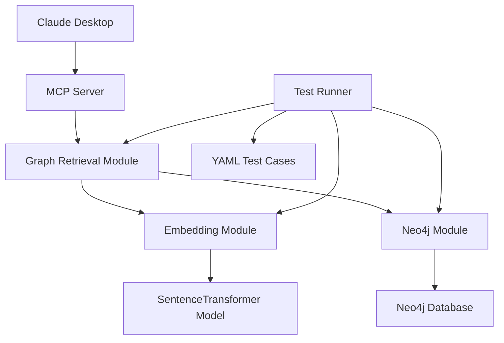

# Design Document

## Overview

The GraphRAG retrieval agent is a minimal, modular system that combines vector similarity search with graph traversal to provide contextually rich information retrieval. The system consists of independent modules for embedding generation, Neo4j operations, graph retrieval logic, and MCP server interface, all containerized for consistent deployment.

## Architecture



The architecture follows a layered approach:
- **Interface Layer**: MCP server for external communication
- **Business Logic Layer**: Graph retrieval orchestration
- **Data Access Layer**: Neo4j operations and embedding generation
- **Testing Layer**: YAML-driven test framework

## Components and Interfaces

### 1. Embedding Module (`embedding.py`)
**Purpose**: Generate embeddings for queries using sentence-transformers

**Interface**:
```python
def generate_embedding(text: str) -> List[float]  # Raises EmbeddingError
def get_model_info() -> dict
```

**Exception Handling**: Catches model loading failures, text encoding errors

### 2. Neo4j Module (`neo4j_client.py`)
**Purpose**: Handle all Neo4j database operations

**Interface**:
```python
def connect() -> Driver  # Raises Neo4jError
def vector_search(embedding: List[float], limit: int = 5) -> List[dict]  # Raises Neo4jError
def expand_graph(chunk_ids: List[int]) -> List[dict]  # Raises Neo4jError
def close()
```

**Exception Handling**: Connection timeouts, authentication failures, query errors

### 3. Graph Retrieval Module (`retrieval.py`)
**Purpose**: Orchestrate the complete retrieval process

**Interface**:
```python
def retrieve(query: str) -> List[dict]  # Raises RetrievalError
def _combine_results(chunks: List[dict], context: List[dict]) -> List[dict]
```

**Exception Handling**: Empty queries, graph expansion failures, result combination errors

### 4. MCP Server Module (`mcp_server.py`)
**Purpose**: Expose GraphRAG functionality via MCP protocol

**Interface**:
```python
def setup_server() -> Server  # Raises MCPServerError
def graph_retrieve_tool(query: str) -> dict  # Catches all exceptions, returns structured errors
```

**Exception Handling**: Server startup failures, invalid parameters, downstream errors

### 5. Logging Module (`logging_config.py`)
**Purpose**: Configure structured logging with external storage

**Interface**:
```python
def setup_logging(config_path: str = "config/logging.yaml") -> None
def get_logger(name: str) -> Logger
def log_execution_trace(request_id: str, operation: str, details: dict) -> None
```

### 5. Configuration Module (`config.py`)
**Purpose**: Load and validate YAML configuration files

**Interface**:
```python
def load_config(config_path: str = "config/app.yaml") -> dict
def validate_config(config: dict) -> bool
```

**Configuration Files**:
- `config/app.yaml`: Application settings (Neo4j, embedding model, etc.)
- `config/logging.yaml`: Logging configuration
- `environment.yml`: Python packages and dependencies

### 6. Main Entry Point (`main.py`)
**Purpose**: Command-line interface and direct usage

**Interface**:
```python
def main(query: str) -> dict
```

## Data Models

### Input Models
```python
# Query input
{
    "query": str  # Natural language query
}
```

### Output Models
```python
# Retrieval result
{
    "results": [
        {
            "author": str,
            "article": str, 
            "chunk_text": str,
            "score": float
        }
    ],
    "total_results": int
}
```

### Neo4j Schema
```cypher
# Nodes
(:Chunk {text: string, embedding: vector})
(:Article {title: string})
(:Author {name: string})

# Relationships
(:Article)-[:HAS_CHUNK]->(:Chunk)
(:Author)-[:WROTE]->(:Article)

# Indexes
CREATE VECTOR INDEX chunk_embeddings FOR (c:Chunk) ON c.embedding
```

## Error Handling

### Error Code System
All errors use unique 4-digit codes with specific categories:
- **1xxx**: Configuration errors
- **2xxx**: Neo4j connection/query errors  
- **3xxx**: Embedding generation errors
- **4xxx**: MCP server errors
- **5xxx**: Retrieval logic errors

### Exception Handling Strategy
```python
class GraphRAGException(Exception):
    def __init__(self, code: int, message: str, details: dict = None):
        self.code = code
        self.message = message
        self.details = details or {}
        super().__init__(f"[{code}] {message}")

# Specific exceptions
class ConfigurationError(GraphRAGException): pass    # 1xxx codes
class Neo4jError(GraphRAGException): pass           # 2xxx codes  
class EmbeddingError(GraphRAGException): pass       # 3xxx codes
class MCPServerError(GraphRAGException): pass       # 4xxx codes
class RetrievalError(GraphRAGException): pass       # 5xxx codes
```

### Error Scenarios
- **1001**: Missing configuration file
- **1002**: Invalid YAML configuration format
- **2001**: Neo4j connection timeout
- **2002**: Authentication failure
- **2003**: Vector index not found
- **3001**: Embedding model loading failure
- **3002**: Text encoding error
- **4001**: MCP server startup failure
- **4002**: Invalid tool parameters
- **5001**: Empty query provided
- **5002**: Graph expansion failure

### Logging and Tracing
- All execution traces logged with unique request IDs
- Logs stored in external volume (`/app/logs` → host volume)
- Structured logging with JSON format for parsing
- Log levels: ERROR, WARN, INFO, DEBUG
- Automatic log rotation and retention policies

## Testing Strategy

### Project Structure
```
graphrag-agent/
├── main.py
├── mcp_server.py
├── modules/
│   ├── embedding.py
│   ├── neo4j_client.py
│   ├── retrieval.py
│   ├── config.py
│   └── logging_config.py
├── config/
│   ├── app.yaml
│   └── logging.yaml
├── tests/
│   ├── test_data.yaml
│   ├── test_runner.py
│   └── fixtures/
│       ├── mock_neo4j.py
│       └── sample_data.yaml
├── logs/                   # External volume mount point
├── environment.yml         # Conda/pip dependencies
├── requirements.txt        # Fallback pip requirements
└── Dockerfile
```

### Test Categories in YAML
```yaml
embedding_tests:
  - name: "basic_embedding"
    input: "test query"
    expected_type: "list"
    expected_length: 384

neo4j_tests:
  - name: "vector_search"
    embedding: [0.1, 0.2, ...]
    expected_results: 3
    
retrieval_tests:
  - name: "end_to_end_query"
    query: "Who wrote about GPT-4?"
    expected_authors: ["Alice", "Bob"]
```

### Testing Approach
- Unit tests for each module using mocked dependencies
- Integration tests with test Neo4j instance
- End-to-end tests via MCP server interface
- All test scenarios defined in YAML for easy maintenance